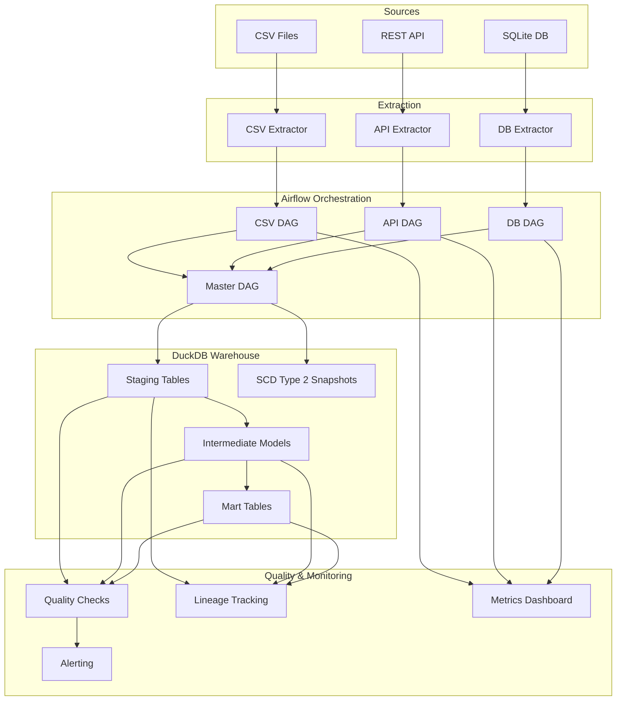

# ETL Orchestration Pipeline

[](https://github.com/KarasiewiczStephane/etl-orchestration/actions/workflows/ci.yml)

> Airflow-based ETL pipeline with DuckDB analytical warehouse, dbt transformations, and data quality checks.

## Architecture



## Features

- **Multi-source extraction**: CSV files, REST API, SQLite database with configurable connectors
- **Incremental loading**: Bookmark-based change data capture for efficient data syncing
- **dbt transformations**: Staging views, intermediate joins, and mart aggregations
- **SCD Type 2 snapshots**: Historical dimension tracking with dbt snapshots
- **Data quality checks**: Schema validation, null checks, freshness, duplicates, and metric bounds
- **Alerting**: Structured logging and webhook notifications on quality failures
- **Lineage tracking**: Source-to-mart data lineage with upstream/downstream queries
- **Pipeline monitoring**: Streamlit dashboard with task duration, success rates, and data volume tracking
- **CI/CD**: GitHub Actions with lint, test, DAG validation, and quality gate

## Quick Start

```bash
# Clone repository
git clone https://github.com/KarasiewiczStephane/etl-orchestration.git
cd etl-orchestration

# Install dependencies
make install

# Run tests
make test

# Run quality checks
make quality-check

# Launch the monitoring dashboard (Streamlit on localhost:8501)
make dashboard
```

### Docker (full Airflow stack)

```bash
# Start all services (Airflow + Mock API)
make docker-up

# Access Airflow UI at http://localhost:8080 (admin/admin)
# Mock API available at http://localhost:5000/api/health

# View logs
make docker-logs

# Stop services
make docker-down
```

## Project Structure

```
etl-orchestration/
├── dags/                          # Airflow DAG definitions
│   ├── etl_csv.py                 # CSV extraction DAG
│   ├── etl_api.py                 # API extraction DAG
│   ├── etl_database.py            # Database extraction DAG
│   └── master_orchestration.py    # Master orchestration DAG
├── src/
│   ├── extractors/                # Source data extractors
│   │   ├── csv_extractor.py       # CSV file extraction with schema validation
│   │   ├── api_extractor.py       # REST API extraction with retry logic
│   │   └── db_extractor.py        # Database extraction with incremental loading
│   ├── loaders/
│   │   └── duckdb_loader.py       # DuckDB staging table loader
│   ├── pipelines/
│   │   └── etl_pipeline.py        # Pipeline orchestration functions
│   ├── quality/
│   │   ├── checks.py              # Data quality check implementations
│   │   └── alerting.py            # Alert routing and failure handling
│   ├── monitoring/
│   │   ├── lineage.py             # Data lineage tracking
│   │   └── metrics.py             # Pipeline metrics collection
│   ├── dashboard/
│   │   └── app.py                 # Streamlit monitoring dashboard
│   └── utils/
│       ├── config.py              # YAML configuration loader
│       ├── db.py                  # DuckDB connection management
│       ├── logger.py              # Structured logging setup
│       ├── bookmark.py            # Incremental loading state management
│       └── dbt_runner.py          # dbt CLI wrapper
├── dbt_project/                   # dbt transformation project
│   ├── models/
│   │   ├── staging/               # Staging views (stg_orders, stg_customers, stg_transactions)
│   │   ├── intermediate/          # Intermediate joins (int_customer_orders, int_customer_transactions)
│   │   └── marts/                 # Mart aggregations (mart_customer_summary, mart_daily_revenue, mart_category_performance)
│   └── snapshots/                 # SCD Type 2 snapshots (snap_customers, snap_orders)
├── mock_api/                      # Flask mock API server
├── configs/
│   ├── config.yaml                # Central project configuration
│   ├── sources.yaml               # Source definitions and schemas
│   └── quality_rules.yaml         # Quality rules and alert configuration
├── data/
│   ├── raw/                       # Raw extracted data (orders, api, database)
│   └── sample/                    # Sample CSV data for development
├── tests/                         # pytest unit and integration tests
├── docker-compose.yml             # Full stack Docker Compose (Airflow + Mock API)
├── Dockerfile                     # Application Docker image
├── Dockerfile.airflow             # Airflow image with dbt-duckdb
├── .github/workflows/ci.yml       # GitHub Actions CI pipeline
├── pyproject.toml                 # Ruff, pytest, coverage configuration
├── Makefile                       # Development and deployment commands
└── requirements.txt               # Python dependencies
```

## Configuration

### Sources (`configs/sources.yaml`)

```yaml
sources:
  csv_orders:
    type: csv
    path: data/raw/orders/
    file_pattern: "*.csv"
    incremental: true
    bookmark_column: created_at
    schema:
      - name: order_id
        type: integer
        nullable: false
```

### Quality Rules (`configs/quality_rules.yaml`)

```yaml
quality_rules:
  source:
    schema_validation: true
    min_row_count: 1
    null_check_columns: [order_id, customer_id]
  staging:
    duplicate_check_keys: [order_id]
    freshness_max_hours: 24
alerts:
  on_failure:
    - type: log
      level: ERROR
    - type: webhook
      url: ${ALERT_WEBHOOK_URL}
```

## DAG Schedules

| DAG | Schedule | Description |
|-----|----------|-------------|
| `etl_csv_orders` | `@hourly` | Extract CSV order files |
| `etl_api_transactions` | `@hourly` | Fetch API transactions |
| `etl_database_customers` | `@daily` | Sync customer database |
| `master_etl_orchestration` | `@daily` | Run full pipeline with dbt |

## dbt Models

### Staging (Views)
- `stg_orders` - Cleaned and typed order data
- `stg_customers` - Customer dimension with standardized fields
- `stg_transactions` - Transaction facts with type casting

### Intermediate (Tables)
- `int_customer_orders` - Orders joined with customer data and line totals
- `int_customer_transactions` - Transactions aggregated per customer

### Marts (Tables)
- `mart_customer_summary` - Customer-level aggregations (lifetime value, order count)
- `mart_daily_revenue` - Daily revenue metrics and order counts
- `mart_category_performance` - Product category performance analysis

### Snapshots (SCD Type 2)
- `snap_customers` - Customer dimension history tracking
- `snap_orders` - Order status change tracking

## Development

```bash
# Install dependencies
make install

# Run tests with coverage
make test

# Lint and format code
make lint

# Run dbt transformations
make dbt-run

# Run data quality checks
make quality-check

# Generate metrics report
make metrics-report

# Launch monitoring dashboard
make dashboard

# Docker operations
make docker-up       # Start all services
make docker-down     # Stop and clean up
make docker-logs     # View service logs
make docker-build    # Rebuild images
```

## Testing

- pytest unit and integration tests across 19 test modules
- dbt schema tests (not_null, unique, accepted_values)
- Airflow DAG parse validation in CI
- Docker Compose configuration validation
- CI workflow structure validation

## Tech Stack

- **Orchestration**: Apache Airflow 2.8
- **Warehouse**: DuckDB
- **Transformations**: dbt-duckdb
- **Quality**: Custom Python quality framework
- **Monitoring**: Streamlit + Plotly
- **CI/CD**: GitHub Actions
- **Containerization**: Docker Compose
- **Language**: Python 3.11


## Author

**Stéphane Karasiewicz** — [skarazdata.com](https://skarazdata.com) | [LinkedIn](https://www.linkedin.com/in/stephane-karasiewicz/)

## License

MIT
